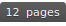
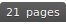
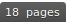

# Recent Advances in Programming Language Processing

## Pretrained Models for Code
-  [CodeBERT:A Pre-Trained Model for Programming and Natural Language](https://arxiv.org/pdf/2002.08155.pdf) - Zhangyin Feng, Daya Guo, Duyu Tang, Nan Duan, Xiaocheng Feng, Ming Gong, Linjun Shou, Bing Qin, Ting Liu, Daxin Jiang, Ming Zhou. (EMNLP 2020 Findings)
-  [Learning and Evaluating Contextual Embedding of Source Code](https://arxiv.org/abs/2001.00059) - Aditya Kanade, Petros Maniatis, Gogul Balakrishnan, Kensen Shi. (ICML 2020)
-  [GraphCodeBERT: Pre-training Code Representations with Data Flow](https://arxiv.org/pdf/2009.08366.pdf) - Daya Guo, Shuo Ren, Shuai Lu, Zhangyin Feng, Duyu Tang, Shujie Liu, Long Zhou, Nan Duan, Alexey Svyatkovskiy, Shengyu Fu, Michele Tufano, Shao Kun Deng, Colin Clement, Dawn Drain, Neel Sundaresan, Jian Yin, Daxin Jiang, Ming Zhou (ICLR 2021)
